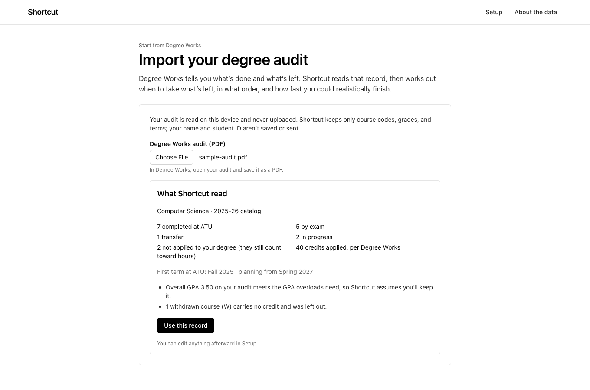

# Shortcut

[](https://github.com/yengnongxiong/atu-grad-shortcut/actions/workflows/ci.yml)

**The degree map is the path for the average student. Shortcut is the path for you.**

Shortcut is a graduation planner for Arkansas Tech University students. Import your Degree Works audit, or enter your credit by hand, and it builds your fastest *realistic* term-by-term plan. It models summer and winter terms, heavier loads, overloads, transfer summer courses, and AP/CLEP/IB credit. It tells you what each option buys in terms saved, which courses actually set your graduation date, and what happens if something goes wrong.

> Not affiliated with Arkansas Tech University. Not official advising. Confirm your plan with your advisor.


## Where it fits

ATU students already have three official planning tools. Each one answers part of the question, and they're both Shortcut's competition and its best inputs.

| Source | What it answers | What it can't answer | How Shortcut uses it |
|---|---|---|---|
| **Academic catalog** ([catalog.atu.edu](https://catalog.atu.edu/)) | The rules: prerequisites, AP/CLEP/IB credit, graduation and load policies | How the rules combine into one student's schedule | AP, CLEP, and IB tables and credit policies saved from the catalog; each course links to its catalog entry |
| **Degree maps** ([one PDF per major, per catalog year](https://www.atu.edu/advising/degreemaps_docs/2025-26/ComputerScience.pdf)) | The average path: 8 semesters for a first-time freshman admitted that year | Anything personal: prior credit, summer, a failed course | Every bachelor's map from 2025–26 on; you plan against the map for the year you started, and can test switching to a newer one |
| **Degree Works** (the registrar's degree audit) | The official record: what's done, in progress, and still needed | When to take what's left, in what order, and how fast it could go | Import your audit (read on your device, never uploaded) and see where Degree Works and the plan agree |
| **Shortcut** | When and in what order: the fastest realistic finish and what each option costs | Official status | A planning aid for the advisor conversation |

**A real record.** Run on the owner's own Degree Works audit (a Fall 2025 CS admit, 2025–26 catalog), Shortcut reads all 27 courses and 77 credits exactly as Degree Works reports them, including AP and CLEP credit. It finds **May 2028, a year ahead of the degree map**. No lever beats that date, because the fall-only Algorithm Design → spring-only Software Engineering chain sets it.

## What it does

- **Starts from your record.** Upload a Degree Works audit, saved as PDF. It's parsed in the browser with pdf.js, and your name and student ID are never read into the plan. A review step shows what was read before anything is applied. Manual setup still works, including posted exam credit and transfer work.
- **Every bachelor's major, every catalog year.** 145 programs from 161 degree-map PDFs (2025–26 and 2026–27), enriched with ATU's public Banner catalog and three years of class schedules. Each program carries a trust label: Cross-checked, Auto-imported, or Needs review.
- **Exam credit from the catalog.** ATU's AP (55 exams), CLEP (43), and IB (82) tables, mapped to exact course codes only. Credit that names no course ("3 hours General Education Humanities") is shown, never guessed.
- **A real schedule, not a checklist.** A constraint solver (OR-Tools CP-SAT) places every remaining course while respecting:
  - prerequisites (AND/OR, minimum grades, placement tests) and corequisites
  - fall-only and spring-only offerings
  - class standing, hour caps, and overload petitions
  - residency and the exam-credit cap
- **Levers priced in terms saved.** Heavier terms, summer, winter, overloads, transfer summer courses, and planned exams. Each shows its *marginal* effect: the full plan vs. the same plan with only that lever off.
- **Bottlenecks.** A prerequisite graph with slack for every course and the critical chain that sets the date. Click any course to test a delay (a real re-solve) or open it in the ATU catalog.
- **What-if.** Fail a course, drop to fewer hours, skip a term, change majors, or switch to a newer catalog, and see exactly which terms change.
- **Degree Works check.** After an import, the plan shows "Degree Works and this plan agree on N of M remaining requirements", plus the differences to bring to an advisor.
- **Honest limits.** When nothing can compress a program, Shortcut names the prerequisite chain responsible instead of inventing a faster path. Admission cycles, Credit for Prior Learning, and unconfirmed summer sections are flagged, not assumed.
- **Advisor export.** A print-ready summary with every assumption and source link.

| | |
|---|---|
|  |  |
|  |  |

## 60-second demo

Every date below was measured against `make serve`.

1. **Pick P1 "Starting from scratch"** (CS freshman, Fall 2026, math ACT 27). The degree map, standard pace, and the plan all say May 2030. The first term matches the map's first semester, Calculus I included.
2. **Toggle Summer terms, Winter intersession, and Heavier regular terms.** Graduation moves to **May 2029, 2 terms sooner**. The lever panel credits heavier terms and summer with 2 terms each (they only work together) and winter with none on its own.
3. **Open Bottlenecks.** The critical chain is COMS 2203 → COMS 2213 → **COMS 3213 (fall only)** → **COMS 3313 (spring only)**. Every link has zero slack.
4. **Open What-if and run "I fail a course"** on COMS 2203. Graduation slips to **May 2030 (2 terms later)**, and the explanation names where the retake lands. Failing Calculus I costs nothing, because taken on schedule it has slack.
5. **Switch to P2 "Exam-credit sprinter."** CLEP scores already land on requirements, so the plan finishes May 2029. The **Exam opportunities** tab ranks AP and CLEP exams by requirement fit and says plainly that none moves the date, because the prerequisite chain sets it.
6. **Start from your Degree Works audit** (landing page). Review what was read, apply it, and check the Degree Works comparison under the headline.
7. **Open Advisor export** and print it.

Two more demo profiles show the edges:
- **P3 "Off-track junior"** (Accounting) is two terms behind the map after an F in fall-only ACCT 3003. The What-if tab shows that switching to Finance, Management, or Business Data Analytics recovers a term (Dec 2028 instead of May 2029).
- **P4 "No shortcut"** (Nursing) has every lever on and none helps. The plan names the five-course NUR prerequisite chain responsible.

## Run it

Requirements: Python 3.12 with [uv](https://docs.astral.sh/uv/), and Node 22.

```bash
make setup        # uv sync + npm ci
make build        # build the React app into backend/shortcut/static
make serve        # one process: app + API on http://localhost:8000
```

For development, `make dev` runs FastAPI with reload on :8000 and Vite on :5173 (proxying `/api`).

| Target | What it does |
|---|---|
| `make test` | pytest (unit, pipeline, acceptance A1–A10, personas, every program) + Vitest |
| `make lint` | ruff, ruff format, mypy --strict, ESLint, tsc |
| `make pipeline-offline` | rebuild `data/processed` from the committed raw snapshots (~1 min) |
| `make pipeline` | re-fetch anything missing from atu.edu and Banner, then rebuild |

Your own record: import your Degree Works audit at `/import`, or copy `data/personas/my-path.template.json` to `data/personas/my-path.json` for a one-click profile on the landing page. Both `my-*.json` and `*audit*.pdf` are git-ignored so real grades never get committed.

### Docker

```bash
docker build -t shortcut .
docker run --rm -p 8000:8000 shortcut      # http://localhost:8000
```

The image is multi-stage: Node builds the frontend, then a slim Python image runs uvicorn as a non-root user with a `/api/health` health check. CI builds it and checks that it serves.

**Deploy notes.** Shortcut is a single stateless service with no database, secrets, or outbound calls at runtime. JSON data is baked into the image and loaded at startup, so it runs anywhere that runs a container on port 8000 (a VPS, Fly.io, Render, or Cloud Run). Nothing has been deployed from this repository.

## Architecture

```
data/raw  ── pipeline ──▶  data/processed/*.json  ──▶  FastAPI (/api)  ◀──▶  React app
(degree-map PDFs,           programs, courses,          planner: CP-SAT        (served by the same
 Banner JSON, catalog       exam tables, policies       + slack + what-if       process; Degree Works
 snapshots)                                                                     import runs in-browser)
```

**Pipeline** (`backend/pipeline`, `python -m pipeline.build`): discover → download → parse → enrich → exams → validate → link catalog years → tier → report.
- `discover.py` takes every catalog year on ATU's degree-map index from 2025–26 on. It also handles two index quirks visibly: one PDF linked under two titles, and one map stored outside the usual folder.
- `parse_degree_map.py` reads each PDF with pdfplumber word coordinates: semester blocks, hours columns, continuation rows, "Fall Only" notes, and gen-ed option boxes.
- `enrich_catalog.py` joins each course to Banner: titles, hours, prerequisite trees, corequisite groups, standing, and offering confidence from catalog text, map notes, and schedule history.
- `catalog_tables.py` parses the AP/CLEP/IB tables saved from catalog.atu.edu (`data/raw/catalog`).
- `catalog_years.py` links each major across catalog years for the "switch to a newer catalog" what-if.
- `validate.py` runs 11 checks per program and assigns the trust tier. `report.py` writes [`data/REPORT.md`](data/REPORT.md).

**Planner** (`backend/shortcut/planner`):
- `profile.py` turns a student's record into credits and remaining items. That covers matching requirements (alternatives, buckets, electives), adding prerequisites the map omits, and fillers for total and upper-level hours.
- `model.py` is the CP-SAT model: x[item, term] for ATU and y[item, term] for transfer.
  - It encodes prerequisites, corequisites, standing via cumulative load, hour caps and overload eligibility, residency, and the exam cap.
  - The solve is two-phase: earliest graduation first, then a polish that prefers fewer short terms, fewer overload hours, the preferred load, and the degree map's order.
- `slack.py` computes per-course slack and the critical chain. `service.py` handles lever attribution, warnings, and the response. `whatif.py` and `exams.py` handle what-ifs, delay impact, and exam opportunities, all as full re-solves.
- Every policy number lives in `data/manual/policies.json` with its ATU source and a confidence label.

**Degree Works import** (`frontend/src/degreeworks`): pdf.js text lines → `parse.ts` (courses, exam credit, still-needed lines) → `toProfile.ts` (a plan request) → `reconcile.ts` (the audit-vs-plan check).

**API** (`backend/shortcut/api`): `GET /api/health`, `/api/meta`, `/api/programs`, `/api/programs/{id}`, `/api/exams`, `/api/personas`; `POST /api/plan`, `/api/plan/whatif`, `/api/plan/exam-opportunities`, `/api/plan/delay-impact`. The schemas are Pydantic v2, mirrored in `frontend/src/api/types.ts`.

**Frontend** (`frontend`): React 19, TypeScript (strict), Vite, Tailwind CSS v4, @xyflow/react with dagre, pdf.js, and Vitest + Testing Library.
- The design is deliberately plain: black on white, one system font, and words instead of color or icons ("Critical" is a label).
- The plan state lives in the URL (`?s=`, shareable) and in localStorage. It's keyboard navigable and targets WCAG AA contrast.

**Performance.** A full CS plan with lever attribution, over all 64 lever combinations, takes a median 0.25 s and p95 0.55 s, measured on an Apple-silicon laptop. The PRD target is p95 under 3 s.

## Data and trust

From [`data/REPORT.md`](data/REPORT.md):

| Catalog year | Bachelor's programs | Cross-checked | Auto-imported | Needs review | Auto-imported or better |
|---|---|---|---|---|---|
| 2025–26 | 72 | 1 | 54 | 17 | 55 (76%) |
| 2026–27 | 73 | 4 | 56 | 13 | 60 (82%) |

- 161 degree maps discovered, 145 bachelor's programs ingested, and 16 associate or other maps excluded (a PRD non-goal).
- 911 courses in `courses.json`, plus a title-and-hours index of every course in ATU's Banner catalog.
- Every one of the 145 programs produces a feasible plan at standard pace (tested).

The tiers mean:
- **Cross-checked:** every automated check passes, *and* the parse was compared row by row against the rendered degree map and Banner. The five are Computer Science (2025–26), Accounting, History, Nursing, and Mathematics, covering all four of ATU's colleges. See [`data/manual/cross_checks.json`](data/manual/cross_checks.json).
- **Auto-imported:** every blocking check passes.
- **Needs review:** a check failed (e.g. a row without hours, or a map typo). You can still plan, with a warning.

### Caveats

- **catalog.atu.edu blocks automated tools**, so course rules come from ATU's public Banner catalog and class schedule. The AP/CLEP/IB tables and credit policies were saved once from a regular browser and are dated. See [D5 and D23](docs/DECISIONS.md).
- **Some ATU pages disagree.** The catalog allows exam credit up to 50% of a degree, while the admissions page says 30 hours. Shortcut uses the stricter value and says so ([D24](docs/DECISIONS.md)).
- **Today's course rules apply to every catalog year.** A 2025–26 program is planned with the current Banner prerequisites and offerings.
- **Offerings are inferred.** Summer and winter availability comes from three years of public schedules, and every inference is labeled with its evidence.
- **Some things can't be scheduled.** Admission cycles, cohort starts, and Credit for Prior Learning are flagged, not modeled.
- **Degree Works is the official record.** Where it and the degree map list requirements differently, Shortcut shows the difference instead of picking a winner.

## How it was built

I wrote the product spec ([PRD.md](PRD.md)) with testable acceptance criteria and built Shortcut by directing Claude Code (Anthropic's coding agent). v1 came from one autonomous run against the PRD.

For v1.1, I tested v1 on my own Degree Works audit and found two real gaps:
- AP and CLEP credit already on a record had no way in.
- Leaving out 4 unapplied hours made the plan a year late.

Those gaps became [a second PRD](docs/prd-v1.1-atu-sources.md) that treats ATU's catalog, degree maps, and Degree Works as inputs rather than competitors. It shipped from a [task-by-task plan](docs/plans/2026-09-29-atu-sources-plan.md), with test-first development and a browser QA pass. Every judgment call made along the way, by me or the agent, is in [docs/DECISIONS.md](docs/DECISIONS.md) (D1–D25), and [CLAUDE.md](CLAUDE.md) is the build brief the agent follows.

## Project documents

- [PRD.md](PRD.md): the v1 product spec, including acceptance tests A1–A10.
- [docs/prd-v1.1-atu-sources.md](docs/prd-v1.1-atu-sources.md): v1.1, building on the catalog, degree maps, and Degree Works.
- [docs/DECISIONS.md](docs/DECISIONS.md): every judgment call.
- [docs/PROGRESS.md](docs/PROGRESS.md): build log and test results.
- [data/REPORT.md](data/REPORT.md): per-program coverage.

## Resume bullets

> **Shortcut**: graduation planner for Arkansas Tech students (product owner; built with Claude Code)
> - Wrote the PRD and acceptance tests, then tested v1 on my own degree audit. That surfaced two data gaps, and I scoped them into v1.1: import Degree Works audits in the browser, and use ATU's catalog and every year's degree maps as inputs.
> - A Python pipeline turns 161 degree-map PDFs, ATU's Banner catalog, and its AP/CLEP/IB tables into 145 validated bachelor's programs across 2 catalog years (79% auto-imported or better). Every program plans at standard pace.
> - An OR-Tools CP-SAT scheduler returns the fastest realistic plan, prices each acceleration option in terms saved, and names the critical prerequisite chain, at p95 0.55 s. Stack: FastAPI, React/TypeScript, 344 automated tests, Docker, GitHub Actions.
