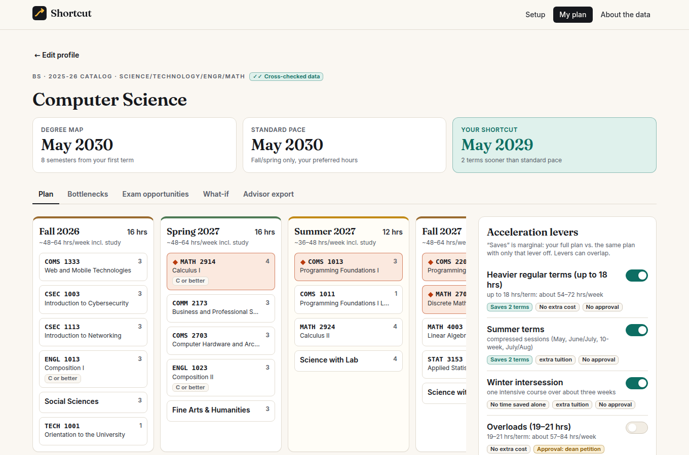
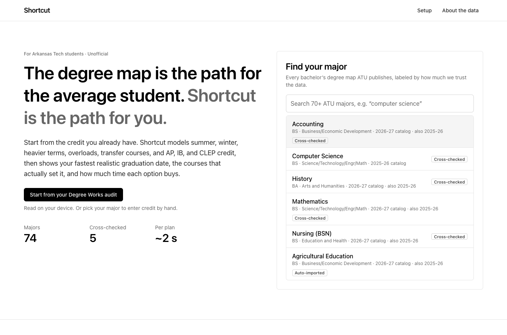
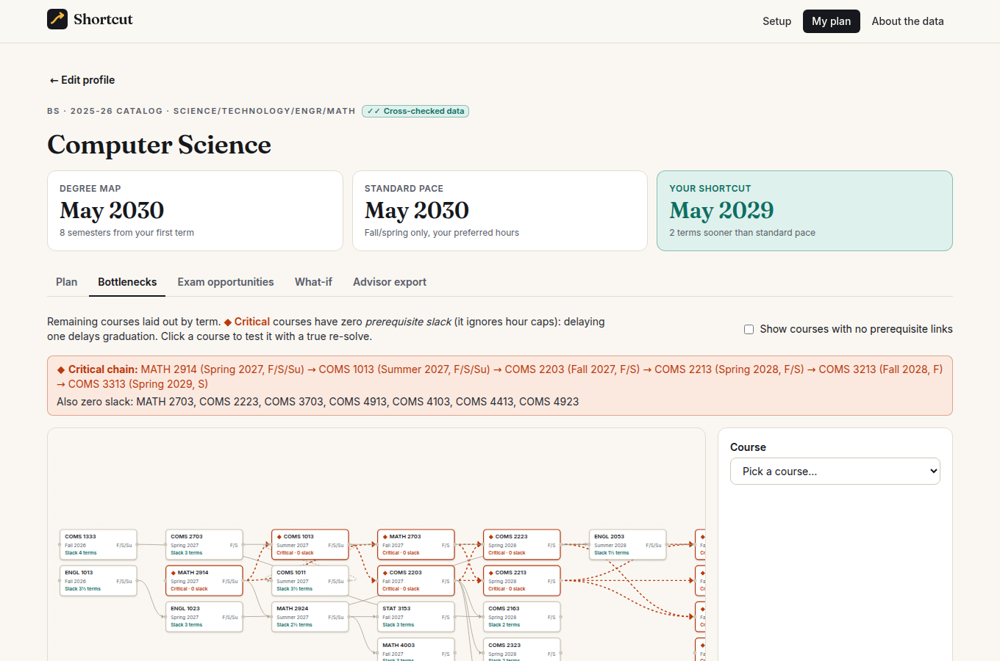
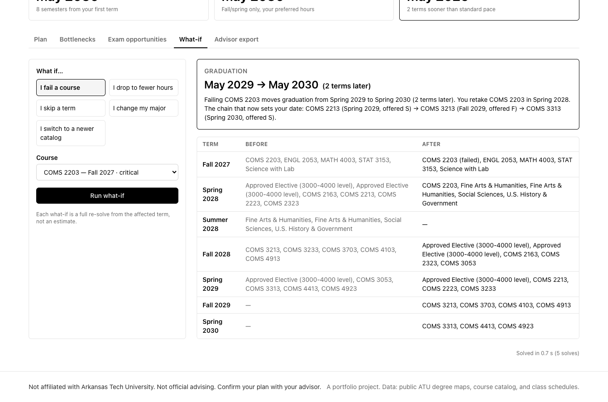
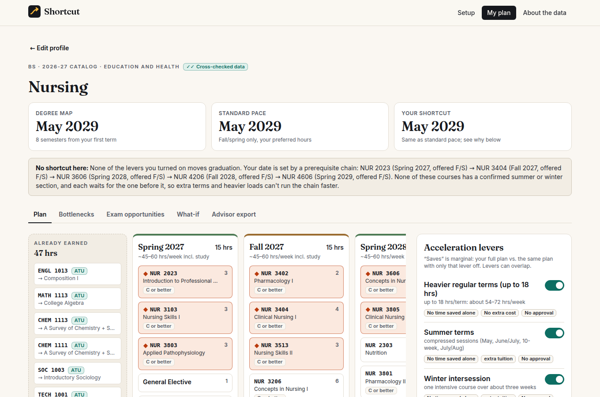

# Shortcut

**The degree map is the path for the average student. Shortcut is the path for you.**

Shortcut is a graduation planner for Arkansas Tech University students. Start from the credit you already have (courses and grades, CLEP scores, transfer work, your math ACT), and it builds your fastest *realistic* term-by-term plan. It models summer and winter terms, heavier loads, overloads, transfer summer courses, and credit by exam. It tells you what each option buys in terms saved, which courses actually set your graduation date, and what happens if something goes wrong.

> Not affiliated with Arkansas Tech University. Not official advising. Confirm your plan with your advisor.



## Where it fits

- **ATU degree maps** give one 8-semester sample schedule, starting from zero credit, fall and spring only.
- **Degree Works** (ATU's degree audit, linked from the advising page) tells you what's left.
- **Advisors** give personal guidance, but with limited time to compare scenarios.

Shortcut answers the question none of them do: *given what I already have, what is the fastest realistic way to finish, and what does each option cost?* Its job is to make the advising conversation better, not to replace it.

## What it does

- **Every bachelor's major.** 74 programs, parsed from ATU's 82 published degree-map PDFs and enriched with 838 course records from ATU's public Banner catalog and three years of class schedules. Each program carries a trust label (Cross-checked, Auto-imported, Needs review).
- **A real schedule, not a checklist.** A constraint solver (OR-Tools CP-SAT) places every remaining course while respecting:
  - prerequisites (AND/OR, minimum grades, placement tests) and corequisites
  - fall-only and spring-only offerings
  - class standing, hour caps, and overload petitions
  - residency and the exam-credit cap
- **Levers priced in terms saved.** Heavier terms, summer, winter, overloads, transfer summer courses, and planned exams. Each shows its *marginal* effect: the full plan vs. the same plan with only that lever off.
- **Bottlenecks.** A prerequisite graph with slack for every course and the critical chain that sets the date. Click any course to see what delaying it does (a real re-solve, not an estimate).
- **What-if.** Fail a course, drop to fewer hours, skip a term, or change majors, and see exactly which terms change.
- **Exam opportunities.** CLEP exams that land on still-needed requirements, ranked by a full re-solve with each exam added.
- **Honest limits.** When nothing can compress a program, Shortcut names the prerequisite chain responsible instead of inventing a faster path. It also doesn't schedule anything it can't verify: admission cycles, Credit for Prior Learning, and unconfirmed summer sections are flagged, not assumed.
- **Advisor export.** A print-ready summary with every assumption and source link.

| | |
|---|---|
|  |  |
|  |  |

## 60-second demo

Every step was run in a headless browser against `make serve`; the dates are what you'll see.

1. **Pick P1 "Starting from scratch"** (CS freshman, Fall 2026, math ACT 27). The headline compares the degree map (May 2030), standard pace (May 2030), and your Shortcut.
2. **Toggle Summer terms, Winter intersession, and Heavier regular terms.** Graduation moves to **May 2029, 2 terms sooner**. The lever panel credits heavier terms and summer with 2 terms each (they only work together) and winter with none on its own.
3. **Open Bottlenecks.** The critical chain is MATH 2914 → COMS 1013 → COMS 2203 → COMS 2213 → **COMS 3213 (fall only)** → **COMS 3313 (spring only)**. Every link has zero slack.
4. **Open What-if and run "I fail a course"** on MATH 2914, the default critical course. Graduation slips back to **May 2030 (2 terms later)**. The explanation names where the retake lands and the chain that now sets the date. COMS 3213 gives the same slip: it's fall-only.
5. **Switch to P2 "Exam-credit sprinter."** Four CLEP scores (16 hours) already land on requirements, so the plan finishes May 2029. The **Exam opportunities** tab ranks the remaining exams by requirement fit. It also says plainly that none of them moves the date under the current levers, because the date is set by the prerequisite chain, not total hours.
6. **Open Advisor export** and print it.

Two more demo profiles show the edges:
- **P3 "Off-track junior"** (Accounting) is two terms behind the map after an F in fall-only ACCT 3003. The What-if tab shows that switching to Finance, Management, or Business Data Analytics recovers a term.
- **P4 "No shortcut"** (Nursing) has every lever on and none helps. The plan names the five-term NUR prerequisite chain responsible.

## Run it

Requirements: Python 3.12 with [uv](https://docs.astral.sh/uv/), and Node 22.

```bash
make setup        # uv sync + npm ci
make build        # build the React app into backend/shortcut/static
make serve        # one process: app + API on http://localhost:8000
```

For development, `make dev` runs FastAPI with reload on :8000 and Vite on :5173 (proxying `/api`).

Other targets:

| Target | What it does |
|---|---|
| `make test` | pytest (unit, pipeline, acceptance A1–A10, personas) + Vitest |
| `make lint` | ruff, ruff format, mypy --strict, ESLint, tsc |
| `make pipeline-offline` | rebuild `data/processed` from the committed raw snapshots (~1 min) |
| `make pipeline` | re-fetch anything missing from atu.edu and Banner, then rebuild (~30 min cold) |

Your own record: copy `data/personas/my-path.template.json` to `data/personas/my-path.json` and fill it in. It shows up on the landing page as a one-click profile. Keep it out of git if it holds real grades.

### Docker

```bash
docker build -t shortcut .
docker run --rm -p 8000:8000 shortcut      # http://localhost:8000
```

The image is multi-stage: Node builds the frontend, then a slim Python image runs uvicorn as a non-root user with a `/api/health` health check. It's about 380 MB, mostly OR-Tools and its numpy/pandas dependencies. CI builds it and checks that it serves.

**Deploy notes.** Shortcut is a single stateless service with no database, secrets, or outbound calls at runtime. JSON data is baked into the image and loaded at startup. It runs anywhere that runs a container and routes to port 8000, such as a VPS, Fly.io, Render, or Cloud Run. To refresh data, run `make pipeline`, review `data/REPORT.md`, commit, and rebuild the image. Nothing has been deployed from this repository.

## Architecture

```
data/raw  ── pipeline ──▶  data/processed/*.json  ──▶  FastAPI (/api)  ◀──▶  React app
(PDFs, Banner JSON,         programs, courses,          planner: CP-SAT       (served by the
 policy pages)              exams, policies             + slack + what-if      same process)
```

**Pipeline** (`backend/pipeline`, `python -m pipeline.build`): discover → download → parse → enrich → exams → validate → tier → report.
- `parse_degree_map.py` reads each PDF with pdfplumber word coordinates. It detects semester blocks, hours columns, continuation rows, "Fall Only" notes, and gen-ed option boxes.
- `enrich_catalog.py` joins each course to Banner: titles, hours, prerequisite trees (AND/OR with grades and placement tests), corequisite groups, standing, and offering confidence from catalog text, map notes, and schedule history.
- `validate.py` runs 11 checks per program (hours, totals, catalog resolution, cycles, offering agreement, upper-level feasibility, and more) and assigns the trust tier.
- `report.py` writes [`data/REPORT.md`](data/REPORT.md).

**Planner** (`backend/shortcut/planner`):
- `profile.py` turns a student's record into credits and remaining items. It matches requirements (alternatives, buckets, electives), adds prerequisites the map omits, and adds fillers for total and upper-level hours.
- `model.py` is the CP-SAT model: x[item, term] for ATU and y[item, term] for transfer. It encodes prerequisites, corequisites, standing via cumulative load, hour caps and overload eligibility, residency, and the exam cap. The solve is two-phase: earliest graduation first, then a polish pass that prefers fewer short terms, fewer overload hours, and map order.
- `slack.py` computes per-course slack and the critical chain. `service.py` handles lever attribution (one extra solve per lever), warnings, and the response. `whatif.py` and `exams.py` handle what-ifs, delay impact, and exam opportunities, all as full re-solves.
- Every policy number (caps, thresholds, GPA rules) lives in `data/manual/policies.json` with its ATU source and a confidence label.

**API** (`backend/shortcut/api`): `GET /api/health`, `/api/meta`, `/api/programs`, `/api/programs/{id}`, `/api/exams`, `/api/personas`; `POST /api/plan`, `/api/plan/whatif`, `/api/plan/exam-opportunities`, `/api/plan/delay-impact`. The schemas are Pydantic v2, mirrored in `frontend/src/api/types.ts`.

**Frontend** (`frontend`): React 19, TypeScript (strict), Vite, Tailwind CSS v4, @xyflow/react with dagre, Vitest + Testing Library.
- The plan state lives in the URL (`?s=`, shareable) and in localStorage.
- It's keyboard navigable, targets WCAG AA contrast, and never uses color as the only signal: critical courses carry an icon and text too.

**Performance.** A full CS plan with lever attribution, measured over all 64 lever combinations in the build container, takes a median 0.8 s and p95 2.2 s. The PRD target is p95 under 3 s.

## Data and trust

From [`data/REPORT.md`](data/REPORT.md):
- 82 degree maps discovered, 74 bachelor's programs ingested, and 8 associate or other maps excluded (PRD non-goal).
- Of the 74, **5 are Cross-checked, 56 Auto-imported, and 13 Need review**, so **82% are Auto-imported or better**.
- **888 courses** in total.
- All 74 programs produce a feasible plan at standard pace.

The tiers mean:
- **Cross-checked:** every automated check passes, *and* the parse was compared row by row against the rendered degree map and Banner. The five cross-checked programs are Computer Science, Accounting, History, Nursing, and Mathematics, covering all four of ATU's colleges. The records and findings are in [`data/manual/cross_checks.json`](data/manual/cross_checks.json).
- **Auto-imported:** every blocking check passes.
- **Needs review:** a check failed (e.g. a row without hours, or a map typo). You can still plan, with a warning.

### Caveats

- **The course catalog site isn't reachable from the build environment** (catalog.atu.edu sits behind a bot challenge), so course data comes from ATU's public Banner catalog and class schedule instead. See [DECISIONS.md](DECISIONS.md) D5.
- **CLEP only.** AP and IB equivalency tables are catalog-only, so they aren't available (D6). CLEP comes from ATU's 2026–27 CLEP equivalency table (PRD Appendix B).
- **Offerings are inferred.** Summer and winter availability comes from three years of public schedules (D8). A course that ran before may not run again, and every inference is labeled with its evidence.
- **Some ATU pages disagree** (e.g. the exam-credit cap: 30 hours vs. 50% of the degree). Shortcut uses the stricter value and says so.
- **Some things can't be scheduled.** Admission cycles, cohort starts, and Credit for Prior Learning are flagged, not modeled.
- **Banner prerequisites are sometimes out of date.** Where they cite retired courses, those links are dropped and recorded (D11). Where they list courses the degree map omits, the plan adds the course and explains why.
- Every modeling decision, with its alternatives and reasons, is in [DECISIONS.md](DECISIONS.md).

## Project documents

- [PRD.md](PRD.md): the product spec, including acceptance tests A1–A10.
- [CLAUDE.md](CLAUDE.md): build rules.
- [DECISIONS.md](DECISIONS.md): every judgment call (D1–D15).
- [PROGRESS.md](PROGRESS.md): milestone status and the final summary.
- [data/REPORT.md](data/REPORT.md): per-program coverage.

## Resume bullet

> Built **Shortcut**, a graduation planner for Arkansas Tech students.
> - A Python pipeline turns 82 degree-map PDFs and 838 Banner course records into 74 validated bachelor's programs (5 cross-checked row by row against the source PDFs, spanning all 4 colleges, 82% auto-imported or better).
> - An OR-Tools CP-SAT scheduler returns the fastest realistic term-by-term plan, prices each acceleration option in terms saved, and names the critical prerequisite chain, at p95 2.2 s.
> - Stack: FastAPI, React/TypeScript, 95 automated tests, Docker, and GitHub Actions CI.
