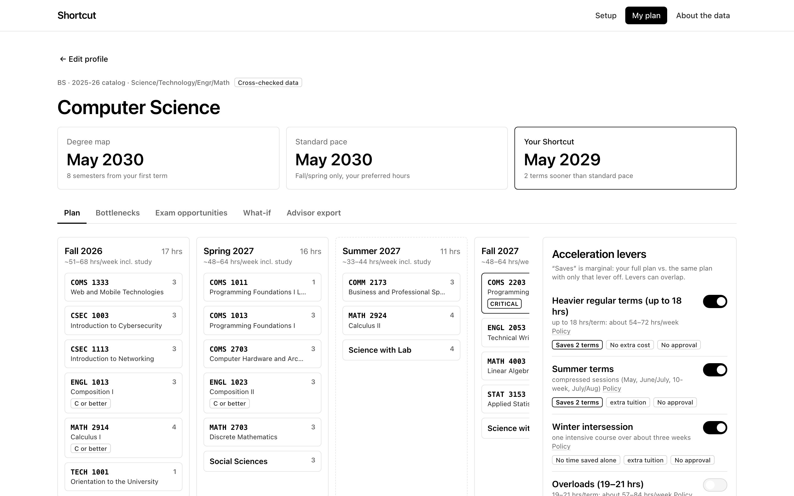
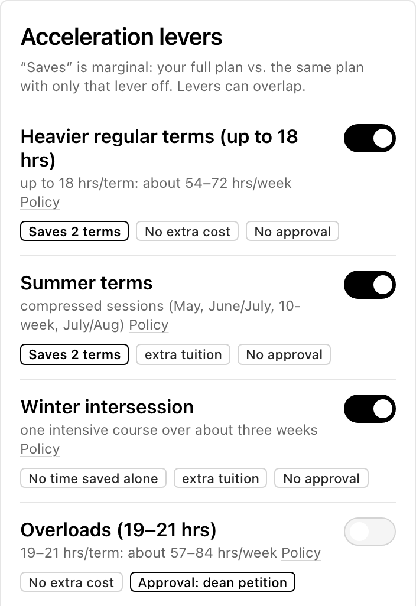
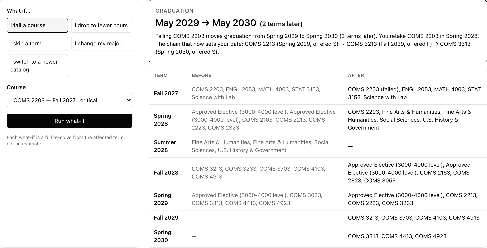
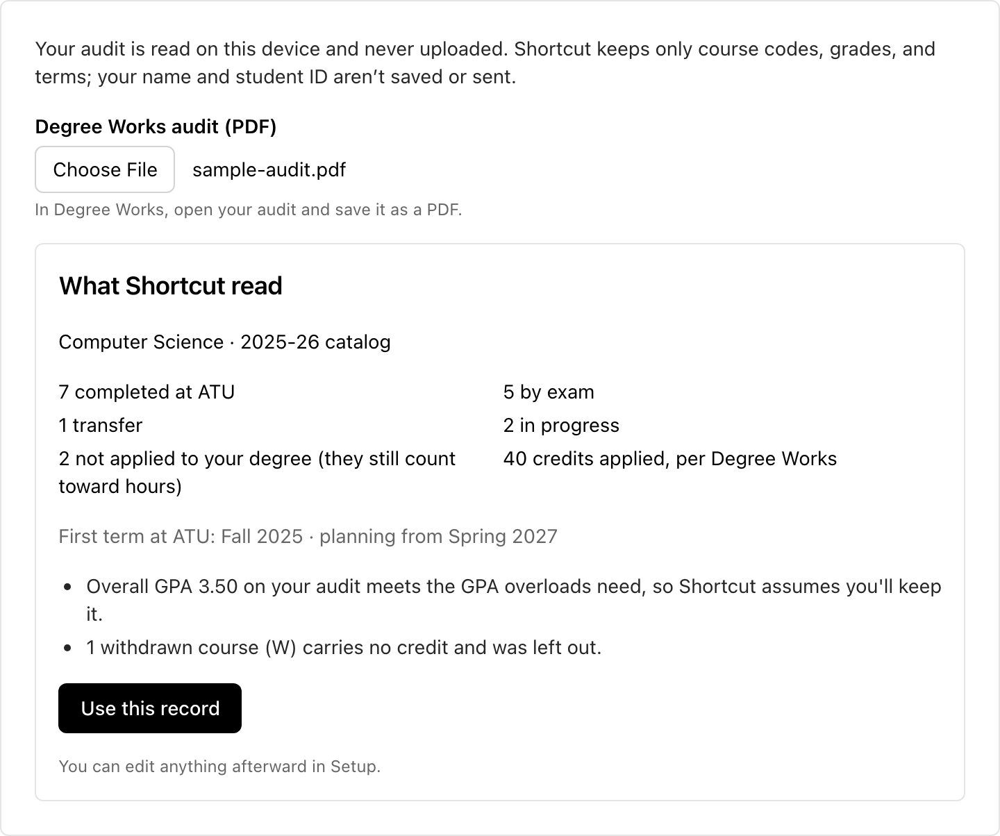
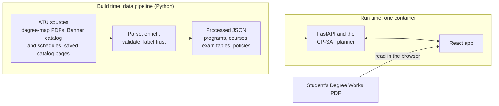
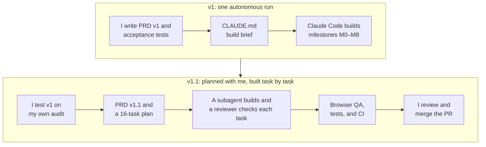

# Shortcut

A graduation planner for Arkansas Tech students. It starts from your Degree Works audit and AP/CLEP/IB credit, finds your fastest realistic path to a degree, and shows which courses set the date.

[](https://github.com/yengnongxiong/atu-grad-shortcut/actions/workflows/ci.yml)



[The problem](#the-problem) · [Walkthrough](#walkthrough) · [Results](#results) · [How it works](#how-it-works) · [How it was made](#how-it-was-made) · [Run it locally](#run-it-locally) · PRD [v1](docs/prd/v1.md) and [v1.1](docs/prd/v1.1.md)

## The problem

Arkansas Tech publishes one degree map per major: an eight-semester schedule for a freshman with no college credit who takes only fall and spring terms and never fails a course. Students with AP or CLEP credit, a failed course, or a plan to finish early fall off that path, and the map never recalculates. The catalog has the rules and Degree Works shows what's left, but nothing says when to take the remaining courses or how fast the degree could go. Missing one fall-only course in a prerequisite chain can cost a full year.

## What it does

- **Starts from your record:** a Degree Works audit read on your device, or credit entered by hand, including AP, CLEP, and IB scores.
- **Builds a term-by-term plan under ATU's rules:** prerequisites, fall-only and spring-only courses, class standing, hour limits, and residency.
- **Prices every option in terms saved:** summer, winter, heavier terms, overloads, transfer courses, and exams, each with its cost and who must approve it.
- **Shows which courses set your graduation date**, and re-plans when you test a failed course, a lighter or skipped term, or a new major.
- **Says so when there's no shortcut**, and names the prerequisite chain responsible.

## Walkthrough

### 1. Start from your record or a demo profile

Import a Degree Works audit, or pick a major and enter credit by hand. Four demo profiles open a finished plan in one click.


### 2. See what each option buys

P1, an incoming Computer Science freshman, finishes in May 2030 on the degree map and at standard pace. With summer, winter, and heavier terms on, the plan finishes in May 2029 (top screenshot). Heavier terms and summer each save 2 terms because they only work together; winter alone saves none.



### 3. Find the courses that set the date

The critical chain COMS 2203 → COMS 2213 → COMS 3213 (fall only) → COMS 3313 (spring only) sets P1's date; every link has zero slack. Clicking a course re-plans with it delayed or failed.


### 4. Test what happens if something goes wrong

Failing COMS 2203 moves graduation from May 2029 to May 2030. The table lists every term that changes.



### 5. Get an honest answer when nothing helps

P4, a pre-nursing sophomore, has every lever on and none moves the date. The plan names the five-course nursing chain responsible instead of inventing a faster path.


### 6. Import a Degree Works audit

Shown with a synthetic sample audit. Shortcut lists what it read before applying anything, and the file never leaves the device.



## Results

| Measure | Result | Evidence |
|---|---|---|
| ATU degree maps parsed | 161 PDFs → 145 bachelor's programs (74 majors, 2 catalog years) | [REPORT.md](data/REPORT.md) |
| Programs passing every blocking data check | 115 of 145 (79%); 5 of them also cross-checked row by row | [REPORT.md](data/REPORT.md), [D15](docs/DECISIONS.md#d15--which-programs-were-cross-checked) |
| Programs with a valid plan at standard pace | 145 of 145 | [test_all_programs.py](backend/tests/acceptance/test_all_programs.py) |
| CS plan time, all 64 lever combinations | median 0.83 s, p95 2.15 s (target: p95 under 3 s) | Measured 2026-09-30, method in [D26](docs/DECISIONS.md#d26--one-solver-worker-so-a-request-always-returns-the-same-schedule) |
| Same request solved 4 times | Identical schedule every time | [test_determinism.py](backend/tests/acceptance/test_determinism.py) |
| Automated tests | 276 backend and 95 frontend tests pass | `make test`, [CI](.github/workflows/ci.yml) |
| Accessibility (axe-core, WCAG 2.1 A/AA) | 0 violations on every page and plan tab | [PROGRESS.md](docs/PROGRESS.md) |
| The owner's real Degree Works audit | 27 courses and 77 credits match Degree Works; the plan finishes May 2028, a year ahead of the map | [D25](docs/DECISIONS.md#d25--degree-works-import-runs-in-the-browser-and-compares-never-overrides) |
| Exam-credit tables from the catalog | AP 55, CLEP 43, IB 82 rows, exact course codes only | [D23](docs/DECISIONS.md#d23--catalog-snapshots-replace-the-unreachable-catalog-supersedes-d6) |

## Built for users

| Decision | Why it helps the user |
|---|---|
| Read the Degree Works audit on the student's device | One file instead of retyping a transcript, and the name and ID never leave the browser ([D25](docs/DECISIONS.md#d25--degree-works-import-runs-in-the-browser-and-compares-never-overrides)) |
| Price each option in terms saved, with its cost and approver | Students see what summer tuition or a petition buys before committing to it |
| Show the critical chain, and let students test a delay or a failure | Students see which course would push graduation back |
| Say "no shortcut" and name the chain responsible | No false promise of a faster path; the student learns why the date is fixed |
| Use the stricter rule when sources disagree, and label every assumption | A plan never looks shorter than it is ([D24](docs/DECISIONS.md#d24--the-exam-credit-cap-conflict-restated), [D16](docs/DECISIONS.md#d16--a-course-retaken-for-a-grade-counts-once-toward-the-degree)) |

## How it works



A data pipeline reads ATU's published documents once: every bachelor's degree map, the public Banner catalog with three years of class schedules, and catalog pages saved from a browser. It checks each program, labels how far its data can be trusted, and writes JSON files, so the app needs no database. For each plan, the API turns the student's record into a list of remaining courses, and a constraint solver places each one in a term, earliest graduation first. A Degree Works audit is read in the student's browser; only course codes, grades, and terms reach the server. Details: [docs/architecture.md](docs/architecture.md).

## Technical choices

### Languages and frameworks

| Choice | What it does | Why it beat the main alternative |
|---|---|---|
| Python, FastAPI, Pydantic | Runs the pipeline, planner, and API, with typed requests and responses | The solver and the PDF parser are Python libraries, so one language covers everything ([D2](docs/DECISIONS.md#d2--python-312-via-uv-frontend-on-vite-8--react-19--ts-6--tailwind-v4)) |
| React, TypeScript, Vite | The web app | API types mirrored in [types.ts](frontend/src/api/types.ts) catch mismatches at build time, not in front of a student |
| pdf.js | Reads the audit PDF in the browser | Parsing on a server would expose the student's name and ID |

### Data storage

| Choice | What it does | Why it beat the main alternative |
|---|---|---|
| No database: JSON loaded at startup ([loader.py](backend/shortcut/data/loader.py)) | Holds programs, courses, exam tables, and policies in memory | The data changes only when ATU publishes and the app never writes, so a database would store nothing |
| Raw sources committed ([data/raw](data/raw)) | Keeps the exact files the pipeline read | Anyone can rebuild the data, and CI fails if it drifts |
| Policies in one file ([policies.json](data/manual/policies.json)) | Each ATU rule with its source and a confidence label | One place to fix a rule, and the app links each number to its source |

### Algorithms and data structures

| Choice | What it does | Why it beat the main alternative |
|---|---|---|
| Constraint solver, OR-Tools CP-SAT ([model.py](backend/shortcut/planner/model.py)) | Places every course in a term under all of ATU's rules at once | It proves no earlier date exists; a greedy scheduler can't |
| Two-phase solve | Earliest date first, then preferences: fewer summers, the preferred load, the map's order | Preferences can never move the date ([D22](docs/DECISIONS.md#d22--degree-map-courses-are-charged-for-landing-behind-their-map-semester)) |
| Prerequisite graph with calendar-aware slack ([slack.py](backend/shortcut/planner/slack.py)) | Finds the critical chain | Respects fall-only and spring-only courses, which a textbook critical path ignores |
| AND/OR prerequisite trees | Stores rules like "A and (B or C), C or better" | A flat list made 9 education programs impossible to plan ([D12](docs/DECISIONS.md#d12--corequisites-are-groups-of-alternatives-completion-of-all--courses-is-scoped-to-the-students-program)) |

### System design

| Choice | What it does | Why it beat the main alternative |
|---|---|---|
| One container for app and API ([Dockerfile](Dockerfile)) | FastAPI serves the React build next to `/api` | One thing to deploy; CI builds it and checks that it serves |
| Pipeline at build time | Turns ATU's documents into JSON before the app starts | No outbound calls at runtime, so an ATU site change can't break a plan |
| Trust tiers from 11 checks ([validate.py](backend/pipeline/validate.py)) | Labels each program Cross-checked, Auto-imported, or Needs review | Students see how far to trust a plan |

Lever pricing, determinism, and the full pipeline are in [docs/architecture.md](docs/architecture.md).

## How it was made

I wrote the specs and acceptance tests; Claude Code, Anthropic's coding agent, wrote the code. v1 came from one autonomous run of Claude Code on the web against [PRD v1](docs/prd/v1.md). Testing it on my own Degree Works audit exposed two gaps, which became [PRD v1.1](docs/prd/v1.1.md) and a [16-task plan](docs/plans/2026-09-29-atu-sources-plan.md). v1.1 was built in the CLI and desktop app, with a fresh subagent per task and a review before the next.



| What I did | What Claude Code did |
|---|---|
| Wrote both PRDs, the acceptance tests, and the non-goals | Wrote the code, tests, and data pipeline |
| Set the rules in CLAUDE.md: never invent data, the stricter rule wins, never read a student's name or ID | Logged every judgment call with its alternatives (D1–D28) |
| Tested v1 on my own record and scoped v1.1 | Turned v1.1 into tasks and built each one test first |
| Reviewed and merged each release | Ran browser QA and accessibility and Docker checks, and opened the PRs |

| Technique | How I used it | Evidence |
|---|---|---|
| Context: spec | Features, rules, and acceptance tests A1–A10, written before any code | [PRD v1 §15](docs/prd/v1.md#15-acceptance-tests-automated-name-them-test_a1_-through-test_a10_) |
| Context: build brief | Order of authority, plus the data, planner, and UI rules | [CLAUDE.md](CLAUDE.md) |
| Context: plan | 16 tasks, each with its files, a failing test first, and a review focus | [v1.1 plan](docs/plans/2026-09-29-atu-sources-plan.md) |
| Orchestration: skills and subagents | Superpowers (writing-plans, subagent-driven-development), frontend-design, code-review, and code-simplifier | [PR #1](https://github.com/yengnongxiong/atu-grad-shortcut/pull/1), [PR #2](https://github.com/yengnongxiong/atu-grad-shortcut/pull/2) |
| Orchestration: tools | Claude in Chrome and agent-browser for the browser, the context7 MCP server for library docs, the GitHub CLI, and Docker via Colima | [PROGRESS.md](docs/PROGRESS.md) |
| Quality: tests and checks | Acceptance tests, every program planned at standard pace, a design-rule test, and a CI data-drift check | [acceptance tests](backend/tests/acceptance), [design.test.ts](frontend/src/design.test.ts), [ci.yml](.github/workflows/ci.yml) |
| Quality: no invented data | With the catalog blocked, the agent marked AP and IB unavailable instead of guessing them | [D6](docs/DECISIONS.md#d6--ap-and-ib-tables-are-unavailable-in-v1) |

Where I corrected or overruled the agent:
- **My own audit exposed two gaps v1's tests missed:** posted AP and CLEP credit had nowhere to go, and leaving out 4 unapplied hours put the plan a year late ([PRD v1.1 §2](docs/prd/v1.1.md#2-evidence-from-a-real-audit)).
- **I changed the look** from v1's accent colors to plain black and white for a cleaner, more readable look; a test now enforces it ([§3.5](docs/prd/v1.1.md#35-visual-design-minimal)).
- **I unblocked the catalog without working around its bot challenge** by having the pages saved from my own browser session, which brought in AP and IB credit ([D5](docs/DECISIONS.md#d5--catalogatuedu-is-unreachable-here-use-atus-public-banner-catalog--schedule-instead), [D23](docs/DECISIONS.md#d23--catalog-snapshots-replace-the-unreachable-catalog-supersedes-d6)).
- **I removed blanket agent permissions** that the first commit's Claude Code settings granted to anyone who cloned the repo ([§3.6](docs/prd/v1.1.md#36-repository-hygiene-and-qa)).

## Limitations and what's next

- Not affiliated with Arkansas Tech University. Not official advising. Confirm your plan with your advisor.
- ATU's pages disagree on the exam-credit cap (30 hours vs. 50% of a degree); Shortcut uses the stricter 30 ([D24](docs/DECISIONS.md#d24--the-exam-credit-cap-conflict-restated)).
- 30 of 145 programs are labeled Needs review.
- Summer and winter offerings are inferred from three years of schedules. Admission cycles and Credit for Prior Learning are flagged, not scheduled.
- The cross-checks were done by the build agent, not an advisor. Nothing is deployed, and no student besides me has used it.

**Next:** confirm the exam cap with the registrar, have an advisor review the cross-checks, then deploy and test with students against the PRD's metrics (the share of plans at least one term faster, and the time to a first plan).

## Run it locally

Requirements: Python 3.12 with [uv](https://docs.astral.sh/uv/), and Node 22.

```bash
make setup    # install Python and Node dependencies
make build    # build the React app
make serve    # app and API on http://localhost:8000
```

With Docker only: `docker build -t shortcut . && docker run --rm -p 8000:8000 shortcut`. `make test` and `make lint` run the same checks as CI.

## Repo map

| Path | What it holds |
|---|---|
| [backend/](backend) | FastAPI app, CP-SAT planner, data pipeline, and tests |
| [frontend/](frontend) | React app, including the in-browser Degree Works import |
| [data/](data) | ATU sources, pipeline output, policies, demo profiles, and the coverage report |
| [docs/](docs) | PRDs, architecture, decision log, build log, plan, and screenshots |
| [scripts/](scripts) | `screenshots.py`, which regenerates this README's images |
| [.github/workflows/](.github/workflows) | CI |
| [CLAUDE.md](CLAUDE.md) | The build brief Claude Code follows |
| [Makefile](Makefile) | Every command |
